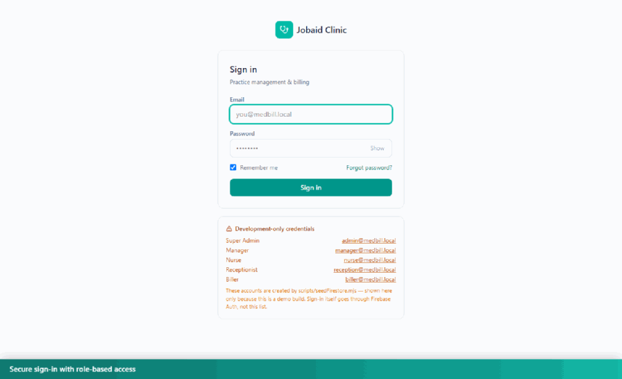

# Jobaid Clinic — Medical Billing & EHR

Software for running a medical clinic: patient records, appointments, insurance, billing,
payments, claims, and reports.

**Repository:** [github.com/jobaid/ClinicalEHRApplication](https://github.com/jobaid/ClinicalEHRApplication)



---

## Start the application

**The easy way — double-click `start-app.cmd`**

That's it. It starts everything and tells you when it's ready.

Two black windows will open and stay open. **Leave them open** — that's the application running.
When you see `Ready`, open your browser to:

### http://localhost:5173

---

## Log in

Use any of these accounts:

| Email | Password | What they can see |
|---|---|---|
| `admin@medbill.local` | `Admin@12345` | Everything, including user management |
| `manager@medbill.local` | `Manager@12345` | Everything except user management |
| `biller@medbill.local` | `Biller@12345` | Billing, claims, reports, patients |
| `nurse@medbill.local` | `Nurse@12345` | Clinical charts, schedule, patients |
| `reception@medbill.local` | `Reception@12345` | Schedule and patients |

Start with **admin@medbill.local** if you just want to look around — it can see every screen.

---

## Stop the application

1. Close the two black windows.
2. Open a terminal in this folder and run:

```
npm run db:stop
```

The second step stops the database. If you skip it, the database just keeps running quietly in
the background — harmless, but it will still be running next time you start.

---

## What you can do

**Patients**
Add patients, search them, and open a full chart: contact details, emergency contact,
guarantor, ID documents, and notes. The system warns you if a patient looks like a duplicate
before creating a second chart.

**Schedule**
Book appointments by day and move them through Scheduled → In progress → Checked out.

**Insurance**
Record Primary, Secondary, and Tertiary coverage. Old insurance is never deleted — when
coverage changes, the previous record is kept and marked terminated, so you always have the
full history.

**Billing**
Post charges per procedure code, then record payments: cash, check, credit card, insurance
credits, patient credits, write-offs, and adjustments. You can also import an electronic
remittance (835) file from an insurer and match it against open claims.

**Claims**
Create a claim from a charge and track it: Draft → Submitted → Paid or Denied.

**Clinical charts**
Vitals, allergies, medications, problem list, and SOAP notes. Once a note is signed it can't be
edited — only amended, with the change recorded.

**Batches**
Open a batch before posting payments and close it at the end of the day. Closed batches stay
available to look at later.

**Reports**
- **Daily Transaction** — every charge and payment for a date range, filtered by doctor, user,
  batch, or procedure code
- **Aging** — outstanding balances by physician, insurance, or self-pay
- **Debit / Credit** — charges posted, and payments and write-offs posted

Every report can be exported to CSV or printed.

**Reminders and support**
Ticklers (follow-up reminders assigned to staff) and an internal support-ticket system.

---

## If something goes wrong

**"Invalid email or password" for every account**

Usually this means the application isn't fully running, not that the password is wrong.

1. Make sure both black windows are still open.
2. Open a terminal in this folder and run `npm run db:status` — it should say PostgreSQL is
   running.
3. If it isn't, close everything and run `start-app.cmd` again.

**The page won't load at all**

The application needs a moment to start. Wait about 10 seconds after `Ready` appears, then
refresh the browser.

**A window closed by itself**

Something failed to start. Run `start-app.cmd` again and read the message before the window
closes.

**You changed something and want a clean start**

Close both windows, run `npm run db:stop`, then run `start-app.cmd` again.

---

## Starting it manually (optional)

If you'd rather not use `start-app.cmd`, the application is three pieces. Start them in this
order, each in its own terminal:

```
npm run db:start     the database
npm run api          the server
npm run dev          the website
```

| Piece | Address | What it does |
|---|---|---|
| Database | port 5433 | Stores all the data |
| Server | port 8080 | Handles logins and all reading/writing |
| Website | port 5173 | What you see in the browser |

---

## Important: your data

All data lives on **this computer**, in the `tools/pgdata` folder. Nothing is stored online.

**There is no backup.** If this computer's disk fails or that folder is deleted, the data is
gone permanently.

To make a backup, run this in a terminal in this folder:

```
tools\pgsql\bin\pg_dump.exe -h 127.0.0.1 -p 5433 -U postgres -d medbill -Fc -f backup.dump
```

Password: `medbill_dev_pw`. Keep the resulting `backup.dump` file somewhere safe — another
drive or a USB stick. Do this regularly.

---

## Who can use it over the network

Anyone on the same Wi-Fi can reach the application. When you start it, the window shows two
addresses — use the second one from another device:

```
Local:   http://localhost:5173      <- this computer
Network: http://192.168.1.183:5173  <- any device on the same Wi-Fi
```

The Network address changes when you connect to a different Wi-Fi, so always read it from that
window rather than memorising it.

This is handy for testing on a phone or another laptop, but it also means the login page is
visible to everyone on that network. It is **not** reachable from the internet.

---

## For developers

Technical documentation — the Go API, the PostgreSQL schema, and the Firebase migration — is in
**[README-MIGRATION.md](README-MIGRATION.md)**.

Quick reference:

| Command | What it does |
|---|---|
| `npm run dev` | Start the website (development) |
| `npm run api` | Start the Go server |
| `npm run db:start` / `db:stop` / `db:status` | Control the database |
| `npm run db:psql` | Open a SQL prompt on the database |
| `npm run build` | Build the website for production |
| `npm run lint` | Check code style |
| `npm run api:build` | Rebuild the Go server after changing Go code |
| `npm run api:test` | Run the Go tests |

**Built with:** React 19 + Vite (frontend), Go (API), PostgreSQL 17 (database), Tailwind CSS.

Go and PostgreSQL are bundled in the `tools/` folder — you don't need to install them
separately.

### Get the code

```
git clone https://github.com/jobaid/ClinicalEHRApplication.git
cd ClinicalEHRApplication
npm install
```

Note that `tools/` (Go and PostgreSQL) and the database itself are not stored in the repository,
so a fresh clone needs them set up before the app will run — see
[README-MIGRATION.md](README-MIGRATION.md).

---

## Author

**Jobaid** — [github.com/jobaid](https://github.com/jobaid)
