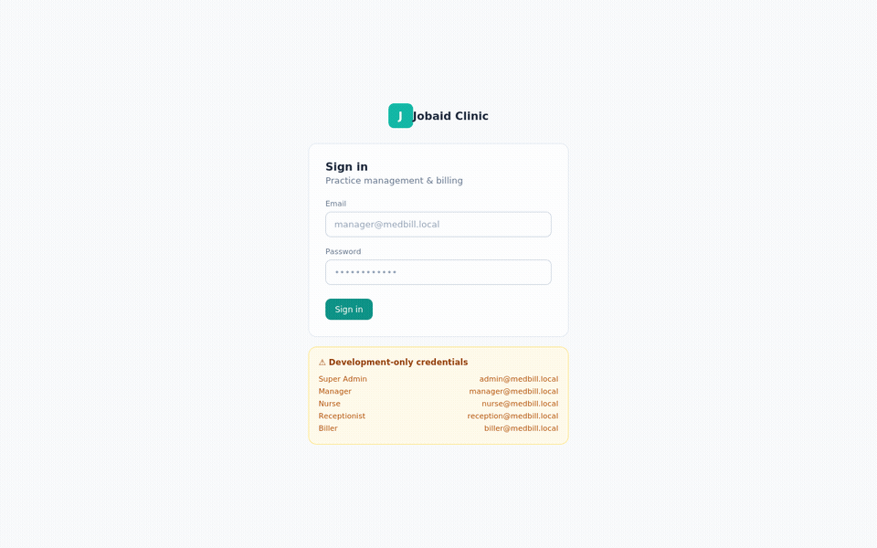

# EHR Practice — Medical Billing & Practice Management Platform

A full-stack-scoped, single-page **medical billing, EHR, and practice management prototype** built with React. It models the actual operational complexity of a clinic's revenue cycle — versioned insurance history, a real X12 835 electronic remittance parser, a double-entry-style financial ledger, and role-gated clinical/billing workflows — not just a CRUD dashboard with health-themed labels.

> **Status:** Frontend prototype (in-memory data). Architecture is designed to drop onto a Node/Express + PostgreSQL/Prisma backend without a rewrite. See [Roadmap](#roadmap).

---

## Why this project

Healthcare billing software is a genuinely hard domain — it's not "patients table + invoices table." This project exists to demonstrate that the following can be modeled correctly, not just described:

- **Insurance is never overwritten.** Every coverage change creates a new, timestamped record; the old one is marked terminated and stays permanently queryable. This is a hard compliance requirement in real practice management systems, and it's enforced in the data layer here, not just the UI copy.
- **Every financial and clinical change is audited.** Insurance edits, priority changes, payment postings, and signed clinical notes all write to an append-only audit log with before/after values, actor, and timestamp.
- **A real EDI parser, not a mock.** The electronic remittance (835) importer parses actual X12 segments — `BPR`, `TRN`, `N1`, `CLP`, `SVC`, `CAS` — reconciles them against open claims, and flags unmatched rows for manual review instead of silently guessing.
- **Signed clinical notes are immutable.** Once a SOAP note is signed, it can only be amended (append-only), never silently edited — the same rule real EHRs enforce for legal defensibility.
- **Money is never floating-point soup.** Every charge line tracks charge / paid / write-off as explicit fields with a single source of truth for balance, feeding a real debit/credit transaction ledger for reporting.

---

## Feature highlights

**Scheduling & Patients**
- Day-grouped appointment scheduling with status workflow (Scheduled → Checked out)
- Patient registration with duplicate-detection (name+DOB, phone+DOB, email+DOB, SSN matching) before a new chart is created
- Full demographics: emergency contact, guarantor/responsible party, address — SSN masked everywhere it's displayed or exported

**Insurance (the centerpiece)**
- Primary / Secondary / Tertiary coverage with a dedicated history table
- Adding new insurance at an occupied priority auto-terminates the prior record and links the transition — nothing is deleted
- Field-level edit history per policy, separate from full-record supersession ("save changes" vs. "save as new coverage record")
- Insurance card upload (front/back), ID document upload with automatic archiving of superseded documents

**Billing & Claims**
- Per-CPT charge ledger (not invoice-level) with payment, write-off, recode/credit, and follow-up memo actions per line
- Manual batch payment posting and **electronic 835 remittance import** with a payer-name/check-EFT-aware reconciliation screen
- Claim lifecycle: Draft → Submitted → Paid/Denied, generated directly from a charge line

**Clinical / EHR**
- Vitals, allergies (with active/resolved status and a chart-header allergy banner), medications, problem list (ICD-10)
- SOAP note authoring with a **Draft → Signed → Amended** workflow — signed notes are never mutated in place

**Reporting**
- Aging report — grouped by physician, insurance payer, or self-pay, with full patient/account/insurance detail per line
- Debit (charges) and credit (payments/write-offs) transaction reports with date-range filters
- CSV and print-to-PDF export on every report

**Auth / Access Control**
- Login with role-based navigation (Super Admin, Manager, Nurse, Receptionist, Biller) matching a real permission matrix
- Runtime "Access Denied" guard, not just hidden buttons — defense in depth even if UI state gets out of sync

---

## Tech stack

| Layer | Technology |
|---|---|
| UI | React (hooks-based, no class components) |
| Styling | Tailwind CSS |
| Icons | lucide-react |
| Charts | Recharts |
| CSV export | PapaParse |
| EDI parsing | Custom X12 835 segment parser (no external library) |

---

## Architecture notes

- **Versioned records over mutation.** Insurance policies, ID documents, and signed clinical notes all follow an append/supersede pattern rather than update-in-place, mirroring how compliant healthcare systems actually have to behave.
- **Single source of truth for money.** `balanceOf(charge)` and a running transaction ledger (`type: charge | payment | writeoff`) drive every dollar figure in the app — the dashboard, the patient ledger, and the reports all read from the same computation instead of maintaining parallel totals that can drift.
- **RBAC modeled at the route level, not just the sidebar.** Navigation is filtered by role *and* the content area independently verifies the current tab is permitted before rendering — so a stale tab state can't leak a restricted view.
- **Deliberately honest about its own limits.** The app surfaces its own scope boundaries in-product (e.g., the login screen's dev-credentials panel is explicitly labeled non-production, OCR fields are manual-entry-only rather than faked) — because pretending a demo is production-grade is a worse engineering habit than admitting the boundary.

---

## Getting started

```bash
npm create vite@latest harborview-clinic -- --template react
cd harborview-clinic
npm install tailwindcss @tailwindcss/vite lucide-react recharts papaparse
```

Add the Tailwind plugin to `vite.config.js`:

```js
import { defineConfig } from 'vite'
import react from '@vitejs/plugin-react'
import tailwindcss from '@tailwindcss/vite'

export default defineConfig({
  plugins: [react(), tailwindcss()],
})
```

Replace `src/index.css` with `@import "tailwindcss";`, drop `ClinicBilling.jsx` into `src/`, import it from `App.jsx`, then:

```bash
npm run dev
```

Sign in with any of the demo accounts shown on the login screen (e.g. `manager@medbill.local` / `Manager@12345`).

---

## Roadmap

This prototype is scoped intentionally — the next milestones are architectural, not cosmetic:

- [ ] Node.js + Express API with Prisma/PostgreSQL, mirroring the current data model 1:1
- [ ] Real authentication (bcrypt + JWT) with server-side permission checks on every route — the current RBAC is UI-only and explicitly documented as such
- [ ] BAA-covered cloud hosting, encryption at rest, and a formal risk assessment before any real PHI touches the system
- [ ] Claims clearinghouse integration (837 outbound) to complement the existing 835 inbound parser
- [ ] Expand EHR to orders, results, and care plans

---

## About this build

This project was built collaboratively with **Claude** (Anthropic) as an engineering exercise in modeling a genuinely complex regulated domain end-to-end — from data architecture through UI — rather than shipping a template with a healthcare skin on it.

**Jobaid Azim**
 · https://www.linkedin.com/in/jobaidazim/ · https://github.com/jobaid/

---

## License

MIT — see `LICENSE`. Demo data only; contains no real patient information.
